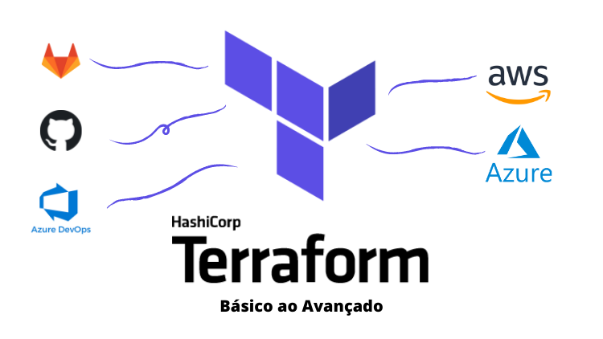

# Configuração do Bloco Terraform

## Contexto

Este repositório foi criado como conteúdo adicional para a aula [**Configuração do Bloco Terraform**](https://www.udemy.com/course/terraform-do-basico-ao-avancado/learn/lecture/30594910#overview) do curso [**Terraform - Básico ao Avançado**](https://www.udemy.com/course/terraform-do-basico-ao-avancado/?couponCode=TERRAFORM_MAR24), por Daniel Gil.

## Conheça o Curso

> Quer ter acesso à aula onde este código foi criado?
>
> Lá você vai encontar explicações detalhadas e vai ter a possibilidade de tirar todas as suas com o professor.
>
> Aqui você encontra um link com um cupom desconto especial para:

**Terraform - Básico ao Avançado**

---
